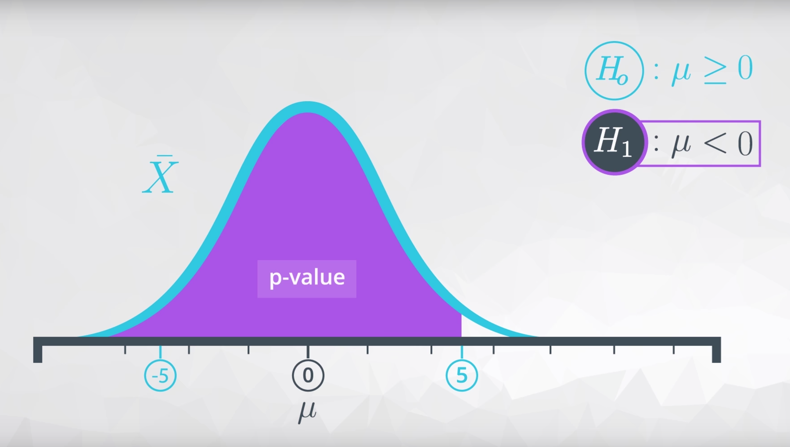
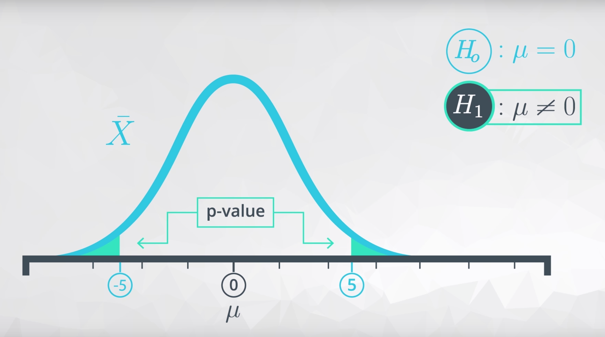

# Hypothesis Testing

## Setting Up Hypothesis Tests
Few rules for setting up null and alternative hypotheses:

1) The H0 is true before you collect any data.

2) The H0 usually states there is no effect or that two groups are equal.

3) The H0 and H1 are competing, non-overlapping hypotheses.

4) H1 is what we would like to prove to be true.

5) H0 contains an equal sign of some kind - either =, ≤, or ≥.

6) H1 contains the opposition of the null - either ≠, >>, or <<.
You saw that the statement, "Innocent until proven guilty" is one that suggests the following hypotheses are true:

#### H0​ : Innocent
#### H1 : Guilty

We can relate this to the idea that "innocent" is true before we collect any data. Then the alternative must be a competing, non-overlapping hypothesis. Hence, the alternative hypothesis is that an individual is guilty.

---

Because we wanted to test if a new page was better than an existing page, we set that up in the alternative. Two indicators are that the null should hold the equality, and the statement we would like to be true should be in the alternative. Therefore, it would look like this:

#### **H0: μ1 ≤ μ2**

#### **H1: μ1 > μ2**

(**μ1** represents population mean from new page, and **μ2** represents population mean from old page)

Depending on your question of interest, you would change your null and alternative hypotheses to match.

## Types of Errors

### Type I Errors
Type I errors have the following features:

1. You should set up your null and alternative hypotheses, so that the worse of your errors is the type I error.
2. They are denoted by the symbol **α**
3. The definition of a type I error is:
  - **Deciding the alternative (H1) is true, when actually (H0) is true**.
4. Type I errors are often called **false positives**.

### Type II Errors
1. They are denoted by the symbol **β**.
2. The definition of a type II error is:  
  - **Deciding the null (H0) is true, when actually (H1) is true**.
3. Type II errors are often called **false negatives**.

In the most extreme case, we can always choose one hypothesis (say always choosing the null) to ensure that a particular error never occurs (never a type I error assuming we always choose the null). However, more generally, there is a relationship where with a single set of data decreasing your chance of one type of error, increases the chance of the other error occurring.

## Common Types of Hypothesis Testing
You are always performing hypothesis tests on **population parameters**, never on statistics. Statistics are values that you already have from the data, so it does not make sense to perform hypothesis tests on these values.

Common hypothesis tests include:

1. Testing a population mean ([One sample t-test](http://sites.utexas.edu/sos/guided/inferential/numeric/claim/one-sample-t/] )).

2. Testing the difference in means ([Two sample t-test](https://www.isixsigma.com/tools-templates/hypothesis-testing/making-sense-two-sample-t-test/))

3. Testing the difference before and after some treatment on the same individual ([Paired t-test](http://www.statstutor.ac.uk/resources/uploaded/paired-t-test.pdf))

4. Testing a population proportion ([One sample z-test](http://stattrek.com/statistics/dictionary.aspx?definition=one-sample%20z-test))

5. Testing the difference between population proportions ([Two sample z-test](https://onlinecourses.science.psu.edu/stat414/node/268))

You can use one of these sites to provide a t-table or z-table to support one of the above approaches: [t-table](https://s3.amazonaws.com/udacity-hosted-downloads/t-table.jpg), [t-table or z-table](http://www.z-table.com/t-value-table.html)

**There are literally 100s of different hypothesis tests!** However, instead of memorizing how to perform all of these tests, you can find the statistic(s) that best estimates the parameter(s) you want to estimate, you can bootstrap to simulate the sampling distribution. Then you can use your sampling distribution to assist in choosing the appropriate hypothesis.

## P-value
The definition of a p-value is the probability of observing your statistic (or one more extreme in favor of the alternative) if the null hypothesis is true.

In this video, you learned exactly how to calculate this value. The more extreme in favor of the alternative portion of this statement determines the shading associated with your p-value.

Therefore, you have the following cases:

If your parameter is greater than some value in the alternative hypothesis, your shading would look like this to obtain your p-value:

If your parameter is less than some value in the alternative hypothesis, your shading would look like this to obtain your p-value:

If your parameter is not equal to some value in the alternative hypothesis, your shading would look like this to obtain your p-value:

You could integrate the sampling distribution to obtain the area for each of these p-values. Alternatively, you will be simulating to obtain these proportions in the next concepts.

## P-value continued
The p-value is the probability of getting our statistic or a more extreme value if the null is true.

Therefore, **small p-values suggest our null is not true**. Rather, our statistic is likely to have come from a different distribution than the null.

**When the p-value is large, we have evidence that our statistic was likely to come from the null hypothesis**. Therefore, we do not have evidence to reject the null.

By comparing our p-value to our type I error threshold (α), we can make our decision about which hypothesis we will choose.

#### pval ≤ α ⇒ Reject H0 (the null)

#### pval > α ⇒ Fail to Reject H0 (the null)

## Conclusion in Hypothesis Testing
The word **accept** is one that is avoided when making statements regarding the null and alternative. You are not stating that one of the hypotheses is true. Rather, you are making a decision based on the likelihood of your data coming from the null hypothesis with regard to your type I error threshold.

Therefore, the wording used in conclusions of hypothesis testing includes:

- **We reject the null hypothesis**
  - (pval ≤ α ⇒ Reject H0)

- **We fail to reject the null hypothesis.**
  - (pval > α ⇒ Fail to Reject H0)

This lends itself to the idea that you start with the null hypothesis true by default, and "choosing" the null at the end of the test would have been the choice even if no data were collected.
​
## Other Things to Consider - What if our sample size is large?
One of the most important aspects of interpreting any statistical results (and one that is frequently overlooked) is assuring that your sample is truly representative of your population of interest.

Particularly in the way that data is collected today in the age of computers, response bias is so important to keep in mind. In the 2016 U.S election, polls conducted by many news media suggested a staggering difference from the reality of poll results. You can read about how response bias played a role [here](http://www.pewresearch.org/fact-tank/2016/11/09/why-2016-election-polls-missed-their-mark/).

### Hypothesis Testing vs. Machine Learning
With large sample sizes, hypothesis testing leads to even the smallest of findings as ** statistically significant**. However, these findings might not be practically significant at all.

For example, Imagine you find that **statistically** more people prefer beverage 1 to beverage 2 on a study of more than one million people. Based on this you decide to open a shop to sell beverage 1. You then find out that beverage 1 is only more popular than beverage 2 by 0.0002% (but a statistically significant amount with your large sample size). Practically, maybe you should have opened a store that sold both.

Hypothesis testing takes an aggregate approach towards the conclusions made based on data, as these tests are aimed at understanding population parameters (which are aggregate population values).

Alternatively, machine learning techniques take an individual approach towards making conclusions, as they attempt to predict an outcome for each specific data point.

In the final lessons of this class, you will learn about two of the most fundamental machine learning approaches used in practice: **linear** and **logistic** regression.

### Other Things to Consider - What if Test More Than Once?
When performing more than one hypothesis test, your type I error compounds. In order to correct for this, a common technique is called the **Bonferroni correction**. This correction is **very conservative**, but says that your new type I error rate should be the error rate you actually want divided by the number of tests you are performing.

Therefore, if you would like to hold a type I error rate of 1% for each of 20 hypothesis tests, the **Bonferroni** corrected rate would be 0.01/20 = 0.0005. This would be the new rate you should use as your comparison to the p-value for each of the 20 tests to make your decision.

Other Techniques
Additional techniques to protect against compounding type I errors include:

- [Tukey correction](http://www.itl.nist.gov/div898/handbook/prc/section4/prc471.htm)
- [Q-values](http://www.nonlinear.com/support/progenesis/comet/faq/v2.0/pq-values.aspx)

### Other Things to Consider - How Do Confidence Intervals and Hypothesis Testing Compare?
A two-sided hypothesis test (that is a test involving a **≠** in the alternative) is the same in terms of the conclusions made as a confidence interval as long as:

#### 1 - Confidence Interval = α

For example, a 95% confidence interval will draw the same conclusions as a hypothesis test with a type I error rate of 0.05 in terms of which hypothesis to choose, because:

#### 1 - 0.95 = 0.05

assuming that the alternative hypothesis is a two sided test.

Video on [effect size here](https://www.youtube.com/watch?v=z98xODInLCQ).

## Recap
1. How to set up hypothesis tests. You learned the null hypothesis is what we assume to be true before we collect any data, and the alternative is usually what we want to try and prove to be true.

2. You learned about Type I and Type II errors. You learned that Type I errors are the worst type of errors, and these are associated with choosing the alternative when the null hypothesis is actually true.

3. You learned that p-values are the probability of observing your data or something more extreme in favor of the alternative given the null hypothesis is true. You learned that using a confidence interval from the bootstrapping samples, you can essentially make the same decisions as in hypothesis testing (without all of the confusion of p-values).

4. You learned how to make decisions based on p-values. That is, if the p-value is less than your Type I error threshold, then you have evidence to reject the null and choose the alternative. Otherwise, you fail to reject the null hypothesis.

5. You learned that when sample sizes are really large, everything appears statistically significant (that is you end up rejecting essentially every null), but these results may not be practically significant.

6. You learned that when performing multiple hypothesis tests, your errors will compound. Therefore, using some sort of correction to maintain your true Type I error rate is important. A simple, but very conservative approach is to use what is known as a Bonferroni correction, which says you should just divide your \alphaα level (or Type I error threshold) by the number of tests performed.
