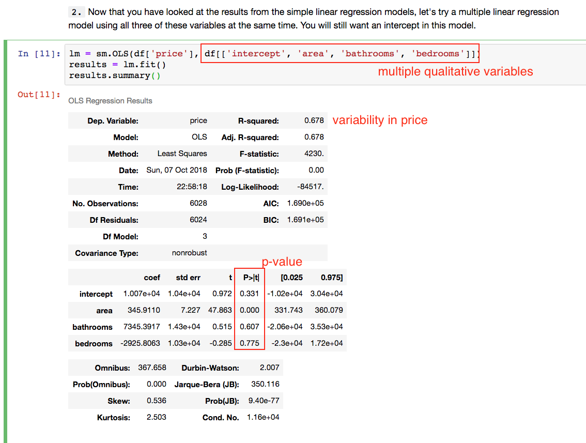
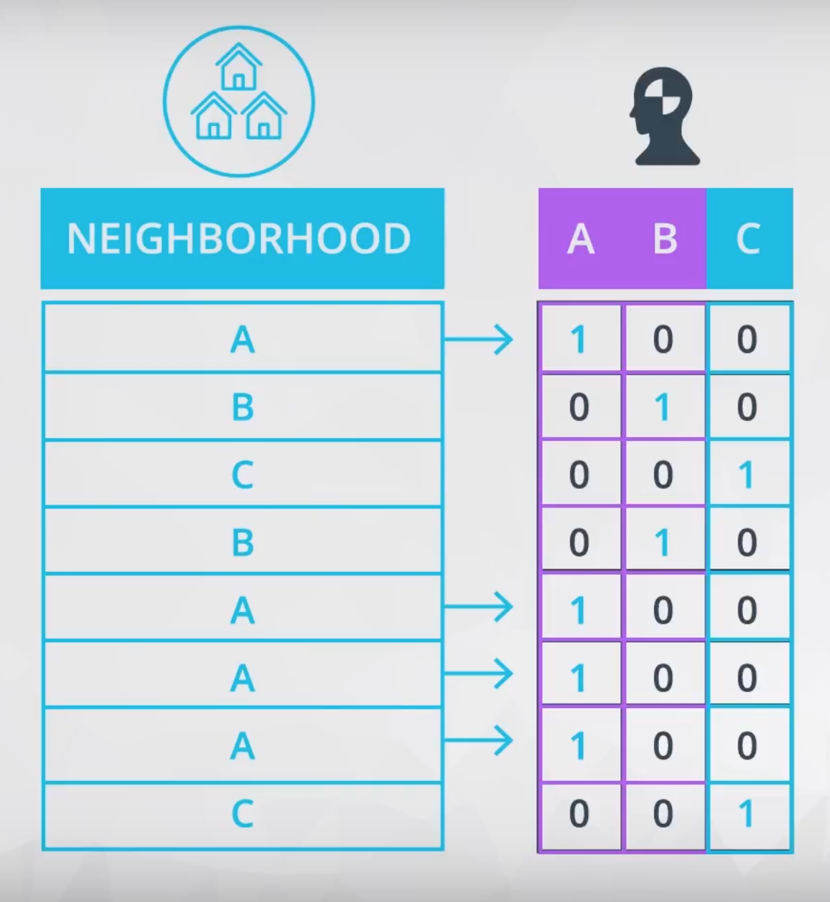
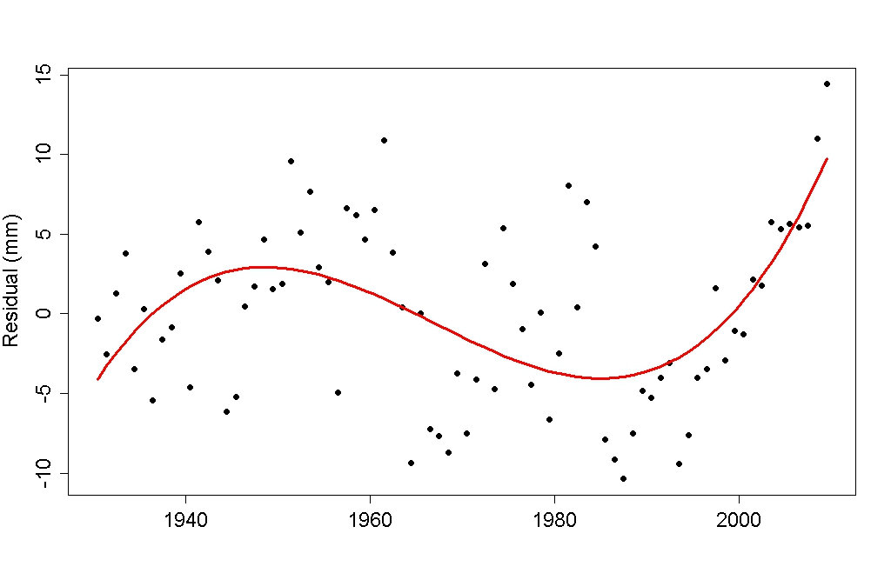
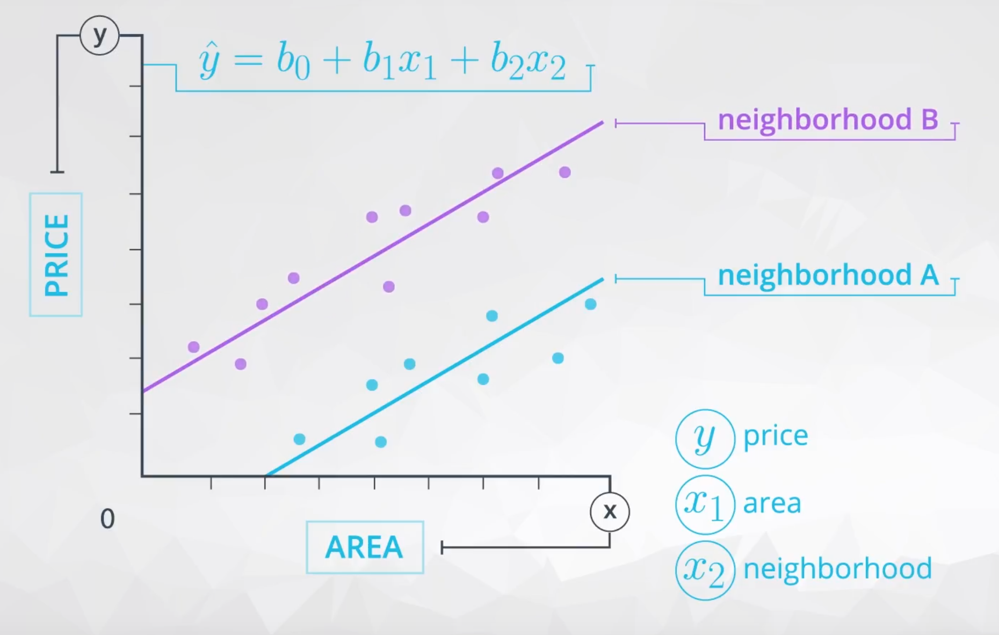
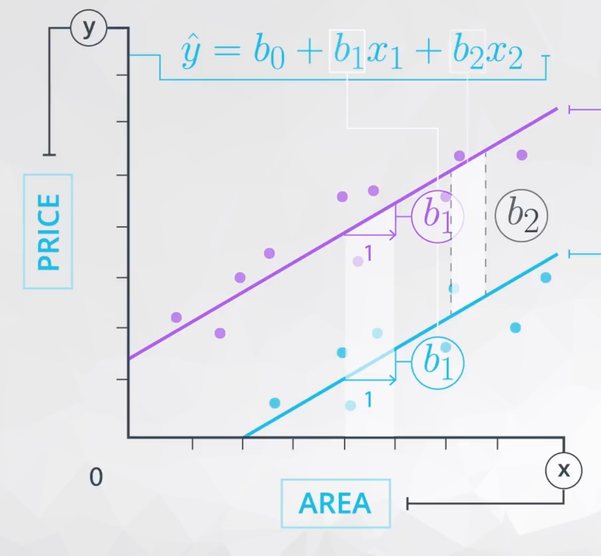
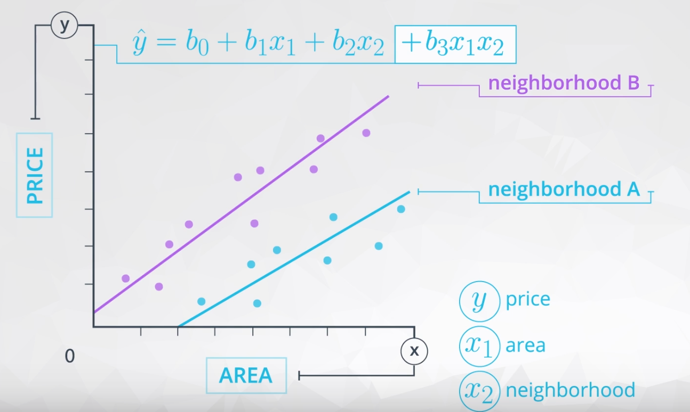

# Multiple Linear Regression
Multiple linear regression (MLR) is a statistical technique that uses several explanatory variables to predict the outcome of a response variable. The goal of multiple linear regression (MLR) is to model the relationship between the explanatory and response variables.

## How Do We Find the "Right" Coefficients in Multiple Linear Regression
In the simple linear regression section, you saw how we were interested in minimizing the squared distance between each actual data point and the predicted value from our model.

But in multiple linear regression, we are actually looking at points that live in not just a two dimensional space.

For a full derivation of how this works, [this article](https://web.stanford.edu/~mrosenfe/soc_meth_proj3/matrix_OLS_NYU_notes.pdf) provides a break down of the steps.

The takeaway for us is that we can find the optimal β estimates by calculating

**(X ′ X) − X ′ y**

## Interpreting MLR Model Results
In the Jupyter notebook example above, the coefficients were all positive. Therefore, we can interpret each coefficient as the **predicted increase in the response for every one unit increase in the explanatory variable, holding all other variables in the model constant**.

However, in general, coefficients might be positive or negative. Therefore, each coefficient is the predicted **change** in the response for every one unit increase in the explanatory variable, holding all other variables in the model constant.

This interpretation is very similar to what you saw in the last lesson with the simple addition of the phrase **"holding all other variables constant"** meaning only the variable attached to the coefficient changes, while all other variables stay the same.

## Using Dummy Variables for Categorical Variables
The way that we add categorical variables into our multiple linear regression models is by using dummy variables. The most common way dummy variables are added is through 1, 0 encoding. In this encoding method, you create a new column for each **level** of a category (in this case A, B, or C). Then our new columns either hold a 1 or 0 depending on the presence of the level in the original column.

When we add these dummy variables to our multiple linear regression models, we always drop one of the columns. The column you drop is called the **baseline**. The coefficients you obThe reason for dropping a dummy variable is to assure that your X matrix is full rank.tain from the output of your multiple linear regression models are then an indication of how the encoded levels compare to the baseline level (the dropped level).

### Takeaways
1. There should always be as many dummy variables added to your X matrix as the number of levels of each categorical variable minus 1.
2. The reason for dropping a dummy variable is to assure that all of our columns are linearly independent.
3. The reason for dropping a dummy variable is to assure that the dot product of X'X is invertible.
4. The reason for dropping a dummy variable is to assure that your X matrix is full rank.

### The Math Behind Dummy Variables
The takeaway is...when you create dummy variables using 0, 1 encodings, you always need to drop one of the columns to make sure your matrices are [full rank](https://www.cds.caltech.edu/~murray/amwiki/index.php/FAQ:_What_does_it_mean_for_a_non-square_matrix_to_be_full_rank%3F) (and that your solutions are reliable from python).

The reason for this is linear algebra. Specifically, in order to invert matrices, a matrix must be full rank (that is all the columns need to be linearly independent). Therefore, you need to drop one of the dummy columns, to create linearly independent columns (and a full rank matrix).

If you do not drop one of the columns when creating the dummy variables, your solution is unstable and results from python are unreliable. You will see an example of what happens if you do not drop one of the dummy columns in the next concept.

### Using Dummy Variables with NumPy and Pandas
[Dummy Variables notebook](./DummyVariables.html)

## Problems with MLR

### Model Assumptions And How To Address Each
Five assumptions addressed in Introduction to Statistical Learning:

1. Non-linearity of the response-predictor relationships
2. Correlation of error terms
3. Non-constant Variance and Normally Distributed Errors
4. Outliers/ High leverage points
6. Collinearity

More info in [linear_model_assumption.md](./linear_model_assumption.md)

### Multicollinearity & VIFs
**We would like x-variables to be related to the response, but not to be related to one another.** When our x-variables are correlated with one another, this is known as **multicollinearity**. Multicollinearity has two potential negative impacts. As you saw in the previous example,

1. The expected relationships between your x-variables and the response may not hold when multicollinearity is present. That is, you may expect a positive relationship between the explanatory variables and the response (based on the bivariate relationships), but in the multiple linear regression case, it tuns out the relationship is negative.

2. Our hypothesis testing results may not be reliable. It turns out that having correlated explanatory variables means that our coefficient estimates are less stable. That is, standard deviations (often called standard errors) associated with your regression coefficients are quite large. Therefore, a particular variable might be useful for predicting the response, but because of the relationship it has with other x-variables, you will no longer see this association.

We have also looked at two different ways of identifying multicollinearity:

1. We can look at the correlation of each explanatory variable against each other explanatory variable (with a plot or the correlation coefficient).

2. We can look at VIFs for each variable, this calculation will be shown in more detail in the next video.

**When VIFs are greater than 10, this suggests that multicollinearity is certainly a problem in your model.** Some experts even suggest VIFs of greater than 5 can be problematic. In most cases, not just one VIF is high, rather many VIFs are high, as these are measures of how related variables are with one another.

**The most common way of working with correlated explanatory variables in a multiple linear regression model, is simply to remove one of the variables that is most related to the other variables.** Choosing an explanatory variable that you aren't interested in, or isn't as important to you, is a common choice.

### Calculating Multicollinearity & VIFs in NumPy and Pandas
[Multicollinearity & VIFs notebook](./Multicollinearity_&_VIFs.html)

## Higher Order Terms
How to Identify Higher Order Terms?
Higher order terms in linear models are created when multiplying two or more x-variables by one another. Common higher order terms include quadratics and cubics, where an x-variable is multiplied by itself, as well as interactions, where two or more x-variables are multiplied by one another.

In a model with no higher order terms, you might have an equation like:

**ŷ = b0​ + b1x1 + b2x2**

Then we might decide the linear model can be improved with higher order terms. The equation might change to:

**ŷ = b0​ + b1x1 + b2x21 + b3x2 + b4x1x2**
​	 
Here, we have introduced a quadratic (b2x21) and an interaction (b4x1x2) term into the model.

In general, these terms can help you fit more complex relationships in your data. However, they also takeaway from the ease of interpreting coefficients, as we have seen so far. You might be wondering: "How do I identify if I need one of these higher order terms?"

When creating models with **quadratic**, **cubic**, or even higher orders of a variable, we are essentially looking at how many curves there are in the relationship between the explanatory and response variables.

If there is one curve, like in the plot below, then you will want to add a quadratic. Clearly, we can see a line isn't the best fit for this relationship.

Then, if we want to add a cubic relationship, it is because we see two curves in the relationship between the explanatory and response variable. An example of this is shown in the plot below.

https://tamino.wordpress.com/2011/03/31/so-what/

Diving into these relationships a little more closely and creating them in your linear models in python will be the focus in the upcoming videos.

## Interpreting Interactions

### Interaction Terms

In the previous video, you were introduced to how you might go about interpreting interactions (or in being able to identify them.

Mathematically, an interaction is created by multiplying two variables by one another and adding this term to our linear regression model.

The example from the previous video used **area** (x1) and the **neighborhood** (x2) of a home (either **A** or **B**) to predict the home price (_**y**_). At the top of the screen in the video, you might have noticed the equation for a linear model using these variables as:

**ŷ = b0​ + b1x1 + b2x2**

This example does not involve an interaction term, and this model is appropriate if the relationship of the variables looks like that in the plot below.

where b1 is the way we estimate the relationship between **area** and **price**, which in this model we believe to be the same regardless of the neighborhood.

Then b2 is the difference in price depending on which neighborhood you are in, which is the **vertical** distance between the two lines here:

Notice, here the way that **area** is related to **price** is the same regardless of **neighborhood**.

AND

The difference in **price** for the different **neighborhoods** is the same regardless of the area.

When these statements are true, we do not need an interaction term in our model. However, we need an interaction when the **way that area is related to price is different depending on the neighborhood**.

Mathematically, when the way area relates to price depends on the neighborhood, this suggests we should add an interaction. By adding the interaction, we allow the slopes of the line for each neighborhood to be different, as shown in the plot below. Here, we have added the interaction, and you can see this allows for a difference in these two slopes.

These lines might even cross or grow apart quickly. Either of these would suggest an interaction is present between **area** and **neighborhood** in the way they related to the **price**.

### Takeaways

- With higher order terms, the coefficients associated with area and area squared are not easily interpretable.  However, coefficients that are not associated with the higher order terms are still interpretable.

# Multiple Linear Regression Takeaways
1. You learned how to build a multiple linear regression model in Python, which was actually very similar to what you did in the last lesson on simple linear regression.

2. You learned how to encode dummy variables, and interpret the coefficients attached to each.

3. You learned about higher order terms, and how this impacts your ability to interpret coefficients.

4. You learned how to identify what it would mean for an interaction to be needed in a multiple linear regression model, as well as how to identify other higher order terms. But again, these do make interpreting coefficients directly less of a priority, and move your model towards one that, rather, aims to predict better at the expense of interpretation.

5. You learned about the model assumptions, and we took a closer look at multicollinearity. You learned about variance inflation factors, and how multicollinearity impacts the model coefficients and standard errors.
