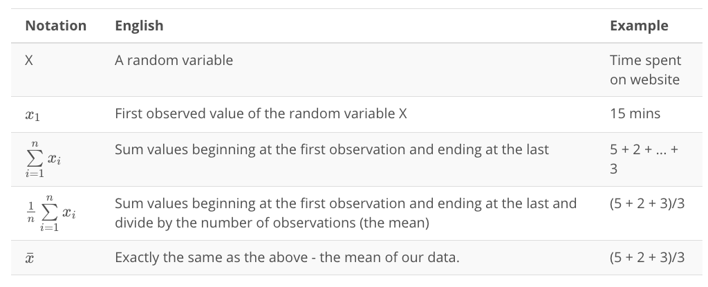
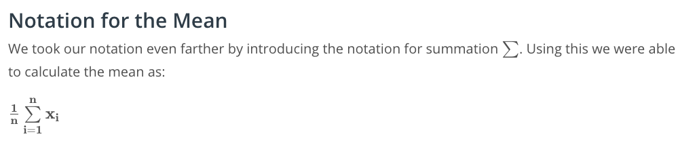
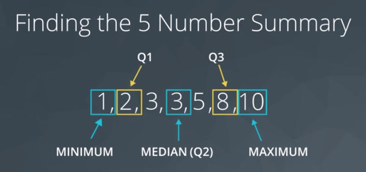
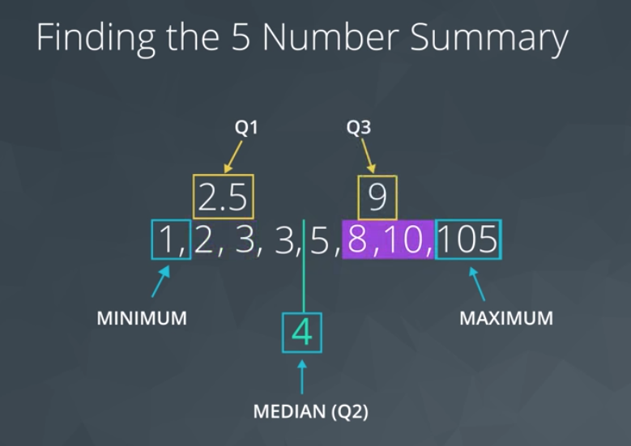
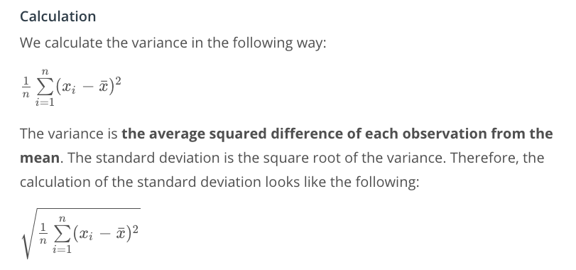

# Descriptive Statistics

## Data Types
Quantitative:	Continuous & Discrete
  - Continuous: Height, Age, Income
  - Discrete: Pages in a Book, Trees in Yard, Dogs at a Coffee Shop

Categorical: Ordinal & Nominal
  - Ordinal (ranked): Letter Grade, Survey Rating
  - Nominal (unranked): Gender, Marital Status, Breakfast Items

## Notation

### Capital vs Lower Case
Random variables are represented by capital letters. Once we observe an outcome of these random variables, we notate it as a lower case of the same letter.

### Agrregation
An aggregation is a way to turn multiple numbers into fewer numbers (commonly one number).

Summation is a common aggregation. The notation used to sum our values is a greek symbol called Sigma Σ.

---

## Measure of Spread
1. Range
2. Interquartile Range (IQR)
3. Standard Deviation
4. Variance

### Histograms

Visual mean of conveying measure of spread.

### 5 Number Summary
1. **Minimum**: The smallest number in the dataset.
2. **Q1**: The value such that 25% of the data fall below.
  - Median of lower 50%
3. **Q2**: The value such that 50% of the data fall below.
4. **Q3**: The value such that 75% of the data fall below.
  - Median of upper 50%
5. **Maximum**: The largest value in the dataset.

Odd number datset:

Even number datset:

### Range
The difference between the maximum and the minimum.

### IQR (Interquartile Range)
The difference between Q3 and Q1.

---

## Standard Deviation & Variance

**Standard Deviation** - The average distance of each observation from the mean.

**Variance** - Average squared difference of each observation from the mean.

Calculation of Std Dev and Variance:

---

## Important Final Points

The variance is used to compare the spread of two different groups. A set of data with higher variance is more spread out than a dataset with lower variance. Be careful though, there might just be an outlier (or outliers) that is increasing the variance, when most of the data are actually very close.

When comparing the spread between two datasets, the units of each must be the same.

When data are related to money or the economy, higher variance (or standard deviation) is associated with higher risk.

The standard deviation is used more often in practice than the variance, because it shares the units of the original dataset.

---

## Shape

1. Right-skewed (leaning to right)
2. Left-skewed (leaning to left)
3. Symmetric ('normal distribution', aka 'bell curve')

| Shape     | Mean vs Median     | Real World Applications |
| :------------- | :------------- |
| Symmetric (Normal) | Mean equals Median | Height, Weight, Errors, Precipitation |
| Right-skewed | Mean greater than Median | Amount of drug remaining in a blood stream, Time between phone calls at a call center, Time until light bulb dies |
| Left-skewed  | Mean less than Median | Grades as a percentage in many universities, Age of death, Asset price changes |

---

## Outliers
#### Common Techniques

When outliers are present we should consider the following points.

1. Noting they exist and the impact on summary statistics.
2. If typo - remove or fix
3. Understanding why they exist, and the impact on questions we are trying to answer about our data.
4. **Reporting the 5 number summary values is often a better indication than measures like the mean and standard deviation when we have outliers.**
5. Be careful in reporting. Know how to ask the right questions.

#### Guidelines for working with any column (random variable) in your dataset.

1. Plot your data to identify if you have outliers.
2. Handle outliers accordingly via the methods above.
3. **If no outliers and your data follow a normal distribution - use the mean and standard deviation to describe your dataset, and report that the data are normally distributed.**
4. If you have skewed data or outliers, use the five number summary to summarize your data and report the outliers.

---

## Descriptive vs Inferential Statistics
