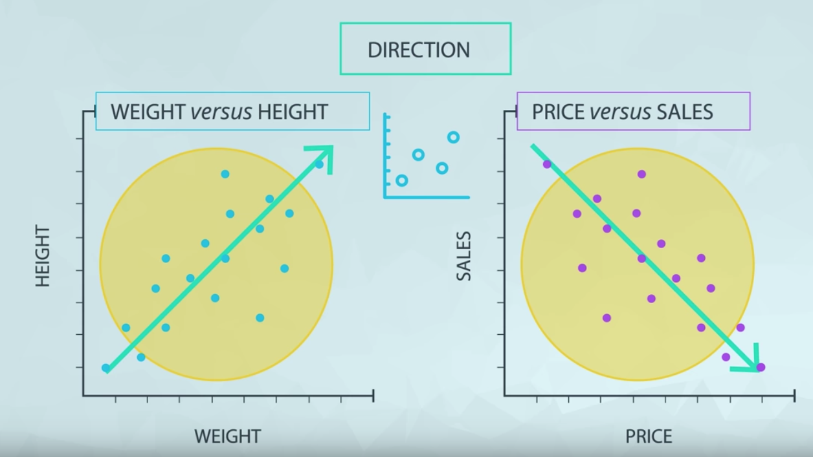
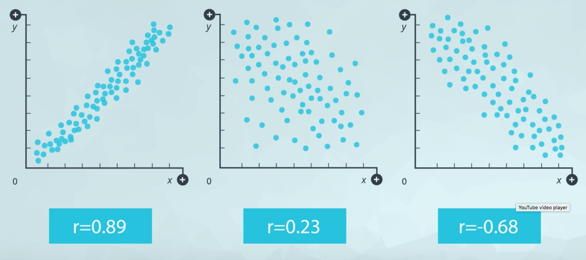
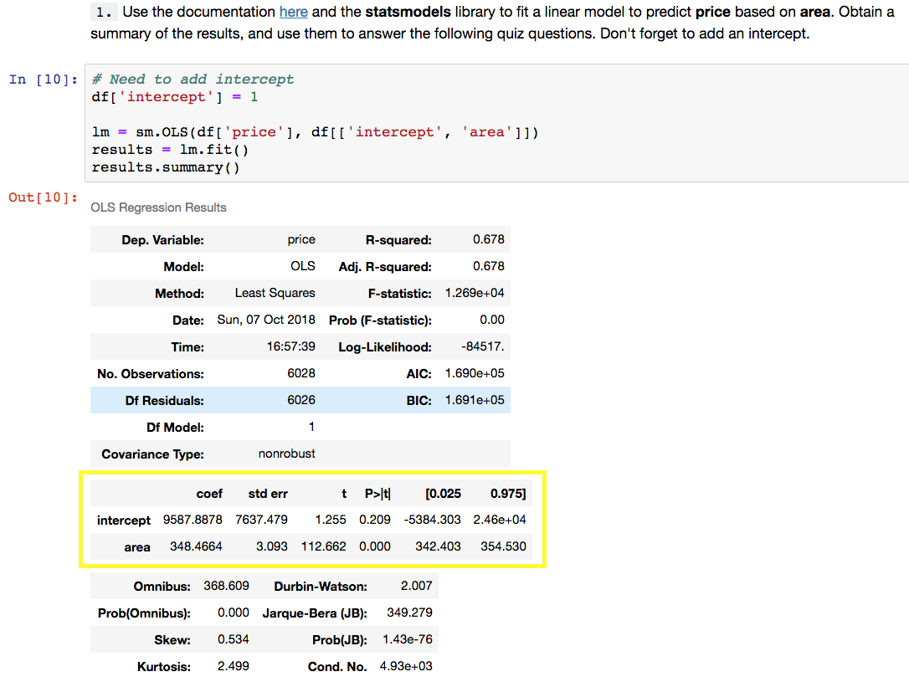
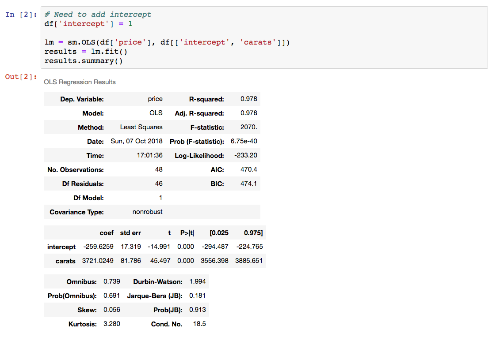
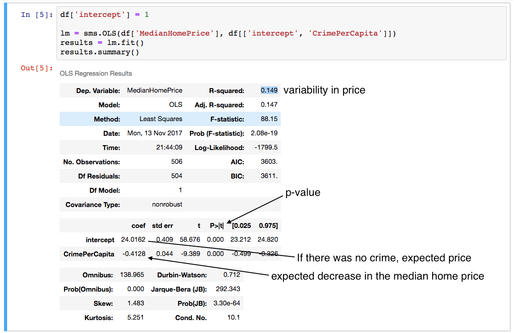

# Regression

Main types of regression:
- Multiple linear
- Logistic

## Background: Regression & Machine Learning
Machine Learning is frequently split into **supervised** and **unsupervised learning**. Regression is an example of supervised machine learning.

In supervised machine learning, you are interested in *predicting a label for your data*. Commonly, you might want to predict fraud, customers that will buy a product, or home values in an area.

In unsupervised machine learning, you are interested in *clustering data together that isn't already labeled*.

## Simple Linear Regression
In a simple linear regression, we compare two quantitative variables to one another.

The **response** variable is what you want to predict, while the **explanatory** variable is the variable you use to predict the response. A common way to visualize the relationship between two variables in linear regression is using a scatterplot. You will see more on this in the concepts ahead.


## Scatter Plots
Scatter plots are a common visual for comparing two quantitative variables. A common summary statistic that relates to a scatter plot is the **correlation coefficient** commonly denoted by **r**.

Though there are a [few different ways](http://www.statisticssolutions.com/correlation-pearson-kendall-spearman/) to measure correlation between two variables, the most common way is with [Pearson's correlation coefficient](https://en.wikipedia.org/wiki/Pearson_correlation_coefficient). Pearson's correlation coefficient provides the:

1. Strength
2. Direction



of a linear relationship. [Spearman's Correlation Coefficient](https://en.wikipedia.org/wiki/Spearman%27s_rank_correlation_coefficient) does not measure linear relationships specifically, and it might be more appropriate for certain cases of associating two variables.


Correlation Coefficient examples:


## Correlation Coefficient
Correlation Coefficients
Correlation coefficients provide a measure of the strength and direction of a linear relationship.

We can tell the direction based on whether the correlation is positive or negative.

A rule of thumb for judging the strength:

| Strong     | Moderate     | Weak |
| :------------- | :------------- | :----------- |
| 0.7 ≤ ∣r∣ ≤ 1.0    | 0.3 ≤ ∣r∣ < 0.7 | 0.0 ≤ ∣r∣ < 0.3 |

### Calculation of the Correlation Coefficient:
CC can be calculated in Excel and other spreadsheet applications using ```CORREL(col1, col2)```, where ```col1``` and ```col2``` are the two columns you are looking to compare to one another.

## Defining a Line
A line is commonly identified by an intercept and a slope.

The **intercept** is defined as the predicted value of the response when the x-variable is zero.

The **slope** is defined as the predicted change in the response for every one unit increase in the x-variable.

We notate the line in linear regression in the following way:

**ŷ = b<sub>0</sub> + b<sub>1</sub>x<sub>1</sub>**
- _**ŷ**_ is the predicted value of the response from the line.
- **_b<sub>0</sub>_** is the intercept
- **_b<sub>1</sub>_** is the slope
- **_x<sub>1</sub>_** is the explanatory variable
- _**y**_ is an actual response value for a data point in our dataset (not a prediction from our line)

The main algorithm used to find the best fit line is called the **least-squares** algorithm.

### R-squared - Does the line fit the model?
The **Rsquared** value is the square of the correlation coefficient.

A common definition for the **Rsquared** variable is that it is the amount of variability in the response variable that can be explained by the x-variable in our model. In general, the closer this value is to 1, the better our model fits the data.

## Fitting a Regression Line in Python
We can perform hypothesis tests for the coefficients in our linear models using Python (and other software). These tests help us determine if there is a statistically significant linear relationship between a particular variable and the response. The hypothesis test for the intercept isn't useful in most cases.

However, the hypothesis test for each x-variable is a test of if that population slope is equal to zero vs. an alternative where the parameter differs from zero. Therefore, if the slope is different than zero (the alternative is true), we have evidence that the x-variable attached to that coefficient has a statistically significant linear relationship with the response. This in turn suggests that the x-variable should help us in predicting the response (or at least be better than not having it in the model).

### Does the line fit the data?
The **Rsquared** value is the square of the correlation coefficient.

A common definition for the Rsquared variable is that it is the *amount of variability in the response variable that can be explained by the x-variable in our model*. In general, the **closer this value is to 1, the better our model fits the data**.

### Example 1: Housing Cost vs Area

- For every one unit increase in area, the predicted increase in price is **348.5**
- Based on our predicted values, it would be unexpected to have a price below **9588**, because this is the predicted price of a house with no area.
- p-value associated with area is very small, which suggests there is statistical evidence that the **population slope associated with an area in relating to price is non-zero**.

### Example 2: Carats vs Price

- For every 0.01 carat increase in the carat size, we can expect the price to increase by **37.21** dollars.
- 97.8% of the variability in price be explained by the diamonds size.
- There 48 diamonds in the dataset.
- Using the Rsquared and the relationship in the scatterplot, the correlation coefficient is 0.99 (calculated by square root of Rsquared).

### Example 3: Homes vs Crime

- For every 100% increase in crime per capita, the expected decrease in the median home price is **412.80** dollars [CrimePerCapita coefficient]
- If there was no crime, we would expect the median home price to be **24016** dollars [intercept coefficient].
- **14.9%** of the variability in price can be explained by the crime per capita [R-squared].
- The p-value of **0.000** associated with crime per capita suggests that it is statistically significant in providing information in predicting the median home values [P>|t|].
- Correlation coefficient is -0.386 [square root of R-squared + direction]

## Recap on Regression
1. Simple linear regression is about building a line that models the relationship between two quantitative variables.
2. Learning about correlation coefficients. You learned that this is a measure that can inform you about the strength and direction of a linear relationship.
3. The most common way to visualize simple linear regression is using a scatterplot.
4. A line is defined by an intercept and slope, which you found using the statsmodels library in Python.
5. You learned the interpretations for the slope, intercept, and Rsquared values.
